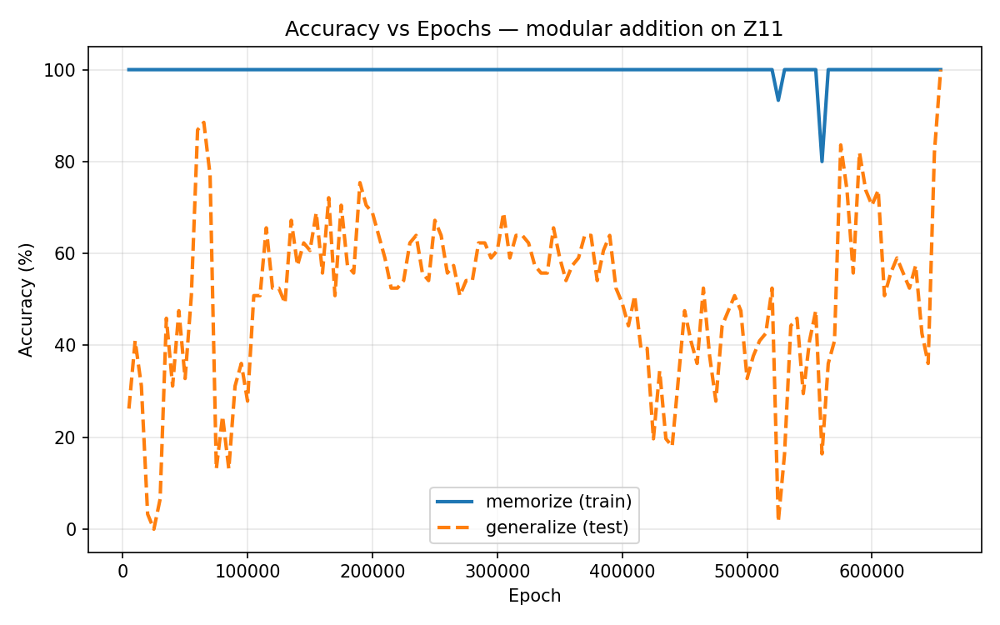

# not-large-model

A tiny decoder-only transformer that learns modular addition on **Zₙ** — i.e. `(a + b) % n` for all pairs `a, b ∈ {0,…,n-1}`.

The goal is to reproduce the [grokking](https://arxiv.org/abs/2201.02177) phenomenon: the model first memorizes the training set (train accuracy → 100%), then much later generalizes to held-out pairs (test accuracy → 100%) in a sudden phase transition.

## Task

Given two digits `a` and `b`, predict the result of `(a + b) mod n`:

```
2 3 = 5
4 7 = 0
9 9 = 7
```

The vocabulary is `["0","1",…,"n-1","="]` — `n+1` tokens total. Each sequence has the form `[a, b, =, result]` (length 4). The model is trained to predict the result token at position 2 (given `a`, `b`, `=`).

## Model

A small decoder-only transformer:

| Hyperparameter   | Value        |
|------------------|--------------|
| `d_model`        | 128          |
| `n_heads`        | 4            |
| `n_layers`       | 2            |
| `dim_feedforward`| `4 × d_model`|
| `dropout`        | 0.0          |
| Sequence length  | 4            |

Built with `nn.TransformerEncoderLayer` (`norm_first=True`, `batch_first=True`, `dropout=0.0`) and a causal mask from `nn.Transformer.generate_square_subsequent_mask`.

## Quickstart

Requires [uv](https://github.com/astral-sh/uv).

```bash
git clone git@github.com:rafaelzimmermann/not-large-model.git
cd not-large-model
uv run not-large-model --mod 11 --until-grok --epochs 1000000 --batch-size 32
```

Training shows a progress bar with live loss and accuracy, evaluates all combinations at the end, saves the model to `model.pt`, and writes a chart to `assets/accuracy.png`.

```
Z11: 121 total pairs — 60 train / 61 test

=== Training ===
100%|████████████████| 1000000/1000000 [loss=0.0012, train=100%, test=100%]

=== Evaluation (all 121 pairs) ===

     Input  Pred  Expected  OK?
------------------------------------
0 0 =    0  (expected 0)  ✓
...

Accuracy: 121/121 = 100%

Model saved to model.pt
Plot saved to assets/accuracy.png
```

Then query the saved model directly:

```bash
uv run not-large-model-predict 7 5
# 7 + 5 = 1  (expected 1, ✓)
```

### Options

```
uv run not-large-model --mod 11 --until-grok --epochs 1000000 --batch-size 32
uv run not-large-model --mod 11 --until-grok --epochs 1000000 --batch-size 32 --save z11.pt
uv run not-large-model --mod 5 --epochs 50000
uv run not-large-model --epochs 50000 --lr 1e-3
uv run not-large-model --epochs 50000 --weight-decay 0.0   # memorizes, never generalizes
uv run not-large-model --epochs 50000 --train-frac 0.3     # harder split
uv run not-large-model --help
```

#### `--mod` (default: `5`)

The modulus `n` for the addition group Zₙ. `--mod 5` gives 25 total pairs; `--mod 11` gives 121. Larger moduli make the task harder to grok and require more epochs. The grokking paper used `n=97`; `n=11` is a good middle ground to observe the phenomenon quickly.

#### `--epochs` (default: `5000`)

One epoch = one full pass over the training set and one gradient update. More epochs give the model more opportunities to generalize. Train accuracy saturates early, but test accuracy may take hundreds of thousands of epochs to catch up — that gap is the grokking phenomenon. When used with `--until-grok`, this becomes a safety cap.

#### `--batch-size` (default: full dataset)

Number of training pairs per gradient update. By default the entire training set is used in one step (full-batch). Smaller batches add gradient noise from shuffling, which prevents the model from over-committing to a single memorization solution and makes grokking substantially more reliable. `--batch-size 32` is recommended for Z11.

#### `--lr` (default: `3e-4`)

The learning rate controls how large each gradient update step is. The original grokking paper used `lr=1e-3` but with `batch_size=512` on thousands of training pairs. Here we train on ~60 pairs, so gradient steps are effectively much larger — `3e-4` keeps the optimization stable enough for train accuracy to settle at 100% before generalization kicks in.

#### `--weight-decay` (default: `1.0`)

Weight decay is an L2 regularization penalty that continuously pushes all weights toward zero. Without it the model memorizes using arbitrarily large weights and never generalizes. With a high value (like `1.0`) the optimizer is forced to find a compact, generalizable solution — the primary driver of grokking. Try `0.0` to see a model that memorizes forever, or values between `0.1` and `10.0` to observe how it changes the delay before generalization.

#### `--train-frac` (default: `0.5`)

Controls the train/test split. At `0.5` the model trains on half the pairs and is tested on the other half. Lowering this makes the task harder; raising it makes it easier to hit 100% test accuracy.

#### `--until-grok`

When set, training continues until test accuracy reaches 100% rather than stopping after a fixed number of epochs. `--epochs` acts as a safety cap. This is the most direct way to observe grokking: the progress bar keeps running and then suddenly the test accuracy jumps.

Recommended command to observe grokking on Z11:

```bash
uv run not-large-model --mod 11 --until-grok --epochs 1000000 --batch-size 32
```

#### `--save` (default: `model.pt`)

Path where the trained model is saved after training. The file stores the model weights and the modulus, so the predict command knows which group it was trained on.

### Predicting

After training, query the model with any two numbers in the group:

```bash
uv run not-large-model-predict 7 5
uv run not-large-model-predict 7 5 --model z11.pt
```

### Grokking

The model first **memorizes** the training pairs (train accuracy → 100% within a few hundred epochs), then much later **generalizes** to the held-out pairs in a sudden phase transition. The chart below shows a real run on Z11 — the train line (solid) hits 100% early while the test line (dashed) oscillates, then makes a sharp jump to 100% at epoch ~290K:



Four design choices are critical for grokking to occur:

1. **High weight decay** (`1.0`) — forces the model away from large, brittle memorization weights toward compact, generalizable representations.
2. **No dropout** — dropout and weight decay together over-regularize and prevent the phase transition.
3. **Result-only supervision** — training only on predicting the result token (not intermediate tokens like `b` or `=`) keeps the gradient signal clean.
4. **Mini-batch training** (`--batch-size 32`) — shuffled mini-batches add gradient noise that prevents the model from locking into a single memorization solution, making grokking reliable rather than lucky.

## Project layout

```
src/not_large_model/
├── vocab.py      # token set, encode/decode helpers
├── dataset.py    # all (a, b) pairs with result-only targets
├── model.py      # TinyTransformer — save/load + forward pass
├── train.py      # AdamW training loop
├── eval.py       # accuracy table over all combinations
├── predict.py    # CLI: load saved model, predict (a + b) % mod
└── scripts/
    └── run.py    # CLI: train, evaluate, save
```

## Inspiration

This project was inspired by [The most complex model we actually understand](https://www.youtube.com/watch?v=D8GOeCFFby4).

## Development

```bash
uv run pytest        # run tests
uv run ruff check .  # lint
uv run ruff format . # format
```
